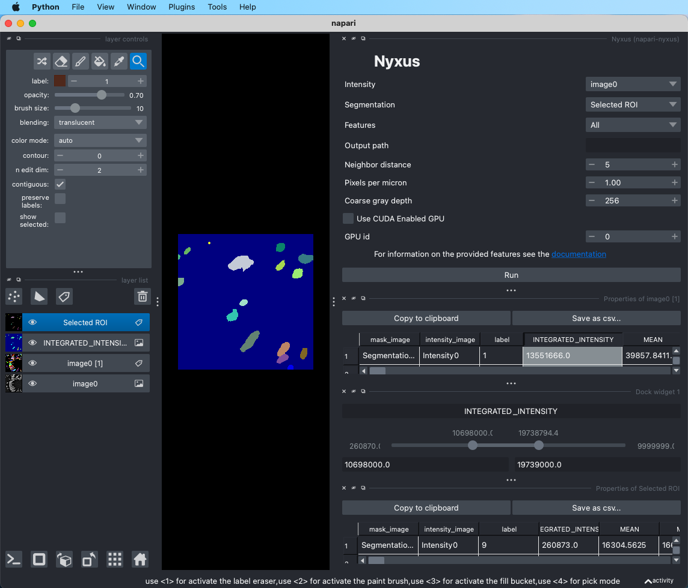

# Nyxus Napari

Nyxus Napari is a Napari plugin for running feature calculations on image-segmentation image pairs, using the
Nyxus application to compute features. Nyxus is a feature-rich, highly optimized, Python/C++ application capable 
of analyzing images of arbitrary size and assembling complex regions of interest (ROIs) split across multiple image tiles and files. 

For more information on Nyxus, see https://github.com/PolusAI/nyxus.
 
# Installation 

To install Napari, it is recommended to first create a separate Conda environment. 

```
conda create -y -n napari-env -c conda-forge python=3.9
conda activate napari-env
```

After creating the Conda environment,
install Napari using pip

```
python -m pip install "napari[all]"
python -m pip install "napari[all]" --upgrade
```

or using conda

```
conda install -c conda-forge napari
conda update napari
```

Next, Nyxus must be installed. Note that the version of Nyxus must be greater than `0.50` to run the Napari plugin.
To install Nyxus, either run

`pip install nyxus`

or build from source using the instructions at https://github.com/PolusAI/nyxus#building-from-source using the conda build for the
python API.

After installing Napari and Nyxus, the Nyxus Napari plugin can be installed by cloning this repo and then building the plugin from the source. 
An example of this process is provided below.

```
git clone https://github.com/PolusAI/napari-nyxus.git
cd napari_nyxus
pip install -e .
```

Napari can then be ran by running 

```
napari
````

# Use
After installing the plugin, start Napari by running the command `napari` from the command line. Once the Napari 
GUI is loaded, the Nyxus plugin can be loaded from the `Plugins` menu in the toolbar by going to Plugins -> nyxus-napari.


A widget will appear in the Napari viewer to run Nyxus.


As shown by the example above, Nyxus will take in Intensity and Segmentation images. These parameters can either be a stack
of images or a single image pair. To load an image pair, use File -> Open File(s)... and select the images to load.


Note that this method can also be used to open a stack of image, by using File -> Open Folder... instead of images. 
The loaded files can then be selected with the Intensity and Segmentation drop down menus. Other parameters can also be changed,
such as which features to calculate. For more information on the available features, see https://nyxus.readthedocs.io/en/latest/featurelist.html.


There is an option to save the feature calculations to a csv file using the Save to csv option. If no path is prodivded in Output path,
the csv will be saved to the current working directory. After running Nyxus, the feature calculations will also appear in the Napari viewer.


The Nyxus Napari plugin provides functionality to interact with the table containing the feature calculatins. For example, if a value
is clicked in the `label` column of the table, the respective ROI will be highlighted in the segmentation image in the viewer.


This feature can also be used in the opposite way, i.e. if an ROI is clicked in the segmentation image, the respective row in the 
feature table will be highlighted.

If one of the column headers are clicked, a colormap will be generated in the Napari viewer showing the values of the features in the clicked
column. For example, if `Intensity` features are calculated, the `INTEGRATED_INTENSITY` column can be clicked and the colormap will appear.


Once the colormap is loaded, a slider will appear in the window with the minimum value being the minimum value of the feature colormap and the 
maximum value of the slider is the maximum value of the colormap. By adjusting the ranges in the slider, a new label image will appear in the viewer
that contains the ROIs who's features values fall within the slider values.


The new labels resulting from the range slider selector can then be used to run Nyxus on by using the labels image as the `Segmentation` parameter.



# Limitations

While Nyxus Napari provides batched processing for large sets of images where each individual image will fit into RAM, 
it does not provide functionality to handle large single images that do not fit into RAM or that are larger than the 
limitations of Napari. For large images, it is recommended to install the Python or CLI version of Nyxus. 
For more information, see https://github.com/PolusAI/nyxus. 